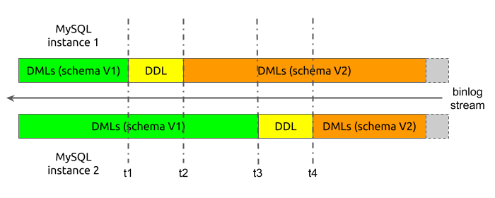
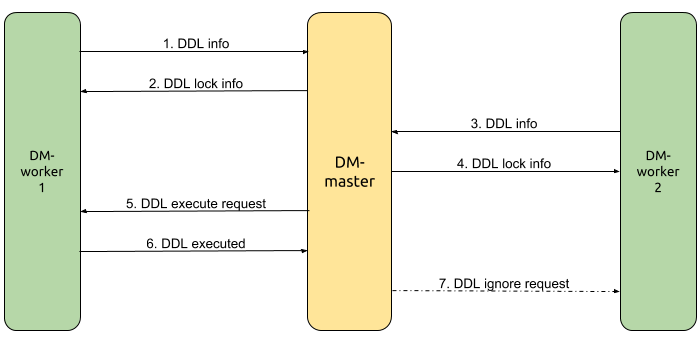

分库分表合并同步
===

### 索引

- [功能介绍](#功能介绍)
- [限制](#限制)
- [背景](#背景)
- [原理](#原理)

### 功能介绍

分库分表合并同步功能用于将上游 MySQL/MariaDB 实例中结构相同的表同步到下游 TiDB 的同一个表中。DM 分库分表合并同步功能既支持同步上游的 DML 数据，也支持协调同步多个上游分表的 DDL 表结构变更。

如果需要执行分库分表合并任务，请在任务配置文件中设置 `is-sharding: true`。

### 限制

- 上游的分表必须以相同的顺序执行（[table 路由](../features/table-route.md) 转换后相同的）DDL
    - 比如不支持 table_1 先增加列 a 后再增加列 b，而 table_2 先增加列 b 后再增加列 a，这种不同顺序的 DDL 执行方式
- 一个逻辑 sharding group 内的所有 DM-worker 对应的上游分表，都应该执行对应的 DDL
    - 比如其中有 DM-worker-2 对应的一个或多个上游分表未执行 DDL，则其他已执行 DDL 的 DM-worker 都会暂停同步任务，等待 DM-worker-2 收到对应上游的 DDL
- 一个逻辑 sharding group 必须等待一个 DDL 完全执行完毕后，才能执行下一个 DDL
- sharding group 数据同步任务不支持 `DROP DATABASE / TABLE`
    - 上游分表的 `DROP DATABASE / TABLE` 语句会被自动忽略
- sharding group 支持 `RENAME TABLE`，但是有下面的限制
    - 只支持 `RENAME TABLE` 到一个不存在的表
    - 一个 `RENAME TABLE` 语句只能有一个 `RENAME` 操作
- 各分表增量同步的起始点的表结构必须一致，才能确保来自不同分表的 DML 可以同步到一个确定表结构的下游，也才能确保后续各分表的 DDL 能够正确匹配与同步
- 如果需要变更 [table 路由](../features/table-route.md) 规则，需要先等所有 sharding DDL 同步完成
    - 当 sharding DDL 在同步过程中时，使用 dmctl 尝试变更 `router-rules` 会报错
- 如果需要 `CREATE` 新表加入到已有的 sharding group 中，需要保持和最新更改的表结构一致
    - 比如原 table_1, table_2 初始时有 (a, b) 两列，sharding DDL 执行后有 (a, b, c) 三列，则同步完成后新 `CREATE` 的表应当有 (a, b, c) 三列
- 由于已经收到 DDL 的 DM-worker 会暂停任务以等待其他 DM-worker 收到对应的 DDL，因此数据同步延迟会增加

### 背景

DM 目前使用 `ROW` format 的 binlog 进行数据同步，binlog 中不包含表结构信息。当使用 Row binlog 同步时，如果没有将多个上游表合并同步到下游的同一个表，则对于下游的一个表只存在一个上游表的 DDL 会更新其表结构，Row binlog 可以认为是具有 self-description 属性。当进行数据同步时，可以根据 column values 及下游的表结构构造出对应的 DML。

在需要将上游的多个表合并同步到下游的同一个表时，如果同步过程中上游表不会执行 DDL 进行表结构变更，可以通过使用 [table 路由](../features/table-route.md) 来转换上游 MySQL/MariaDB 实例的某些表同步到下游指定表中，可以通过使用 [列值转换](../features/column-mapping.md) 来解决合表后自增主键的冲突问题。

但在分表合并同步时，如果上游的表会执行 DDL 进行表结构变更，则需要对 DDL 的同步进行更多处理以避免根据 column values 生成的 DML 与下游实际表结构不一致的问题。下面举一个简化后的例子：

在上图的例子中，分表的合库合表简化成了上游只有两个 MySQL 实例，每个实例内只有一个表。假设在开始数据同步时，将两个分表的表结构 schema 的版本记为 schema V1，将 DDL 执行完成后的表结构 schema 的版本记为 schema V2。

现在，假设数据同步过程中，从两个上游分表收到的 binlog 数据有如下的时序：

1. 开始同步时，从两个分表收到的都是 schema V1 的 DML
2. 在 t1 时刻，收到实例 1 上分表的 DDL
3. 从 t2 时刻开始，从实例 1 收到的是 schema V2 的 DML；但从实例 2 收到的仍是 schema V1 的 DML
4. 在 t3 时刻，收到实例 2 上分表的 DDL
5. 从 t4 时刻开始，从实例 2 收到的也是 schema V2 的 DML

假设在数据同步过程中，不对分表的 DDL 进行处理。当将实例 1 的 DDL 同步到下游后，下游的表结构会变更成为 schema V2。但对于实例 2，在 t2 时刻到 t3 时刻这段时间内收到的仍然是 schema V1 的 DML。当尝试把这些与 schema V1 对应的 DML 同步到下游时，就会由于 DML 与表结构的不一致而发生错误，造成数据无法正确同步。

### 原理

继续使用上面的例子，来说明在 DM 中是如何处理合库合表过程中的 DDL 同步的。

在这个例子中，DM-worker-1 用于同步来自 MySQL 实例 1 的数据，DM-worker-2 用于同步来自 MySQL 实例 2 的数据，DM-master 用于协调多个 DM-worker 间的 DDL 同步。从 DM-worker-1 收到 DDL 开始，简化后的 DDL 同步流程为：

1. DM-worker-1 在 t1 时刻收到来自 MySQL 实例 1 的 DDL，自身暂停该 DDL 对应任务的 DDL 及 DML 数据同步，并将 DDL 相关信息发送给 DM-master
2. DM-master 根据 DDL 信息判断需要协调该 DDL 的同步，为该 DDL 创建一个锁，并将 DDL 锁信息发回给 DM-worker-1，同时将 DM-worker-1 标记为这个锁的 owner
3. DM-worker-2 继续进行 DML 的同步，直到在 t3 时刻收到来自 MySQL 实例 2 的 DDL，自身暂停该 DDL 对应任务的数据同步，并将 DDL 相关信息发送给 DM-master
4. DM-master 根据 DDL 信息判断该 DDL 对应的锁信息已经存在，直接将对应锁信息发回给 DM-worker-2
5. DM-master 根据启动任务时的配置信息、上游 MySQL 实例分表信息、部署拓扑信息等，判断得知已经收到了需要合表的所有上游分表的该 DDL，请求 DDL 锁的 owner（DM-worker-1）向下游同步执行该 DDL
6. DM-worker-1 根据 step.2 时收到的 DDL 锁信息验证 DDL 执行请求；向下游执行 DDL，并将执行结果反馈给 DM-master；若执行 DDL 成功，则自身开始继续同步后续的（从 t2 时刻对应的 binlog 开始的）DML
7. DM-master 收到来自 owner 执行 DDL 成功的响应，请求在等待该 DDL 锁的所有其他 DM-worker（DM-worker-2）忽略该 DDL ，直接继续同步后续的（从 t4 时刻对应的 binlog 开始的）DML

根据上面 DM 处理多个 DM-worker 间的 DDL 同步的流程，归纳以下 DM 内处理多个 DM-worker 间 sharding DDL 同步的特点：

- 根据任务配置与 DM 集群部署拓扑信息，在 DM-master 内建立一个需要协调 DDL 同步的逻辑 sharding group，group 中的成员为处理该任务拆解后各子任务的 DM-worker
- 各 DM-worker 在从 binlog event 中获取到 DDL 后，会将 DDL 信息发送给 DM-master
- DM-master 根据来自 DM-worker 的 DDL 信息及 sharding group 信息创建/更新 DDL 锁
- 如果 sharding group 的所有成员都收到了某一条 DDL，则表明上游分表在该 DDL 执行前的 DML 都已经同步完成，可以执行 DDL，并继续后续的 DML 同步
- 上游分表的 DDL 在经过 [table 路由](../features/table-route.md) 转换后，对应的需要在下游执行的 DDL 应该一致，因此仅需 DDL 锁的 owner 执行一次即可，其他 DM-worker 可直接忽略对应的 DDL

在上面的示例中，每个 DM-worker 对应的上游 MySQL 实例中只有一个需要进行合并的分表。但在实际场景下，一个 MySQL 实例可能有多个分库内的多个分表需要进行合并。当一个 MySQL 实例中有多个分表需要合并时，sharding DDL 的协调同步过程增加了更多的复杂性。

假设同一个 MySQL 实例中有 table_1 和 table_2 两个分表需要进行合并，如下图：

由于数据来自同一个 MySQL 实例，因此所有数据都是从同一个 binlog 流中获得。在这个例子中，时序如下：

1. 开始同步时，两个分表收到的数据都是 schema V1 的 DML
2. 在 t1 时刻，收到了 table_1 的 DDL
3. 从 t2 时刻到 t3 时刻，收到的数据同时包含 table_1 schema V2 的 DML 及 table_2 schema V1 的 DML
4. 在 t3 时刻，收到了 table_2 的 DDL
5. 从 t4 时刻开始，两个分表收到的数据都是 schema V2 的 DML

假设在数据同步过程中不对 DDL 进行特殊处理，当 table_1 的 DDL 同步到下游、变更下游表结构后，table_2 schema V1 的 DML 将无法正常同步。因此，在单个 DM-worker 内部，我们也构造了与 DM-master 内类似的逻辑 sharding group，但 group 的成员是同一个上游 MySQL 实例的不同分表。

但 DM-worker 内协调处理 sharding group 的同步不能完全与 DM-master 处理时一致，主要原因包括：

- 当收到 table_1 的 DDL 时，同步不能暂停，需要继续解析 binlog 才能获得后续 table_2 的 DDL，即需要从 t2 时刻继续向前解析直到 t3 时刻
- 在继续解析 t2 时刻到 t3 时刻的 binlog 的过程中，table_1 的 schema V2 的 DML 不能向下游同步；但在 sharding DDL 同步并执行成功后，这些 DML 需要同步到下游

在 DM 中，简化后的 DM-worker 内 sharding DDL 同步流程为：

1. 在 t1 时刻收到 table_1 的 DDL，记录 DDL 信息及此时的 binlog 位置点信息
2. 继续向前解析 t2 时刻到 t3 时刻的 binlog
3. 对于属于 table_1 的 schema V2 DML，忽略；对于属于 table_2 的 schema V1 DML，正常同步到下游
4. 在 t3 时刻收到 table_2 的 DDL，记录 DDL 信息及此时的 binlog 位置点信息
5. 根据同步任务配置信息、上游库表信息等，判断该 MySQL 实例上所有分表的 DDL 都已经收到；将 DDL 同步到下游执行、变更下游表结构
6. 设置新的 binlog 流的解析起始位置点为 step.1 时保存的位置点
7. 重新开始解析从 t2 时刻到 t3 时刻的 binlog
8. 对于属于 table_1 的 schema V2 DML，正常同步到下游；对于属于 table_2 的 shema V1 DML，忽略
9. 解析到达 step.4 时保存的 binlog 位置点，可得知在 step.3 时被忽略的所有 DML 都已经重新同步到下游
10. 继续从 t4 时刻对应的 binlog 位置点正常同步

从上面的分析可以知道，DM 在处理 sharding DDL 同步时，主要通过两级 sharding group 来进行协调控制，简化的流程为：

1. 各 DM-worker 独立地协调对应上游 MySQL 实例内多个分表组成的 sharding group 的 DDL 同步
2. 当 DM-worker 内所有分表的 DDL 都收到时，向 DM-master 发送 DDL 相关信息
3. DM-master 根据 DM-worker 发来的 DDL 信息，协调由各 DM-worker 组成的 sharing group 的 DDL 同步
4. 当 DM-master 收到所有 DM-worker 的 DDL 信息时，请求 DDL lock 的 owner（某个 DM-worker） 执行 DDL
5. owner 执行 DDL，并将结果反馈给 DM-master；自身开始重新同步在内部协调 DDL 同步过程中被忽略的 DML
6. 当 DM-master 发现 owner 执行 DDL 成功后，请求其他所有 DM-worker 开始继续同步
7. 其他所有 DM-worker 各自开始重新同步在内部协调 DDL 同步过程中被忽略的 DML
8. 所有 DM-worker 在重新同步完成被忽略的 DML 后，继续正常同步
